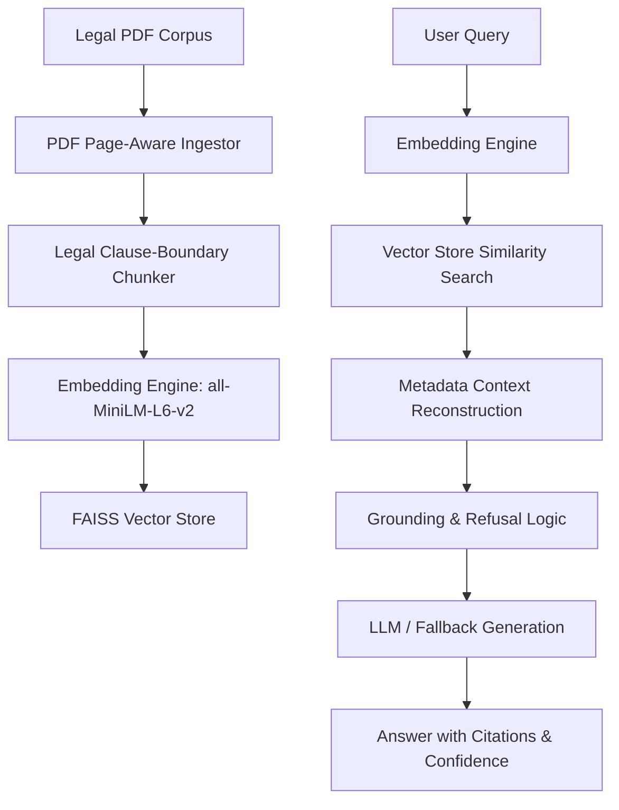

# System Design Review & RAG Architecture

This document details the architectural choices and design patterns implemented for the Production RAG Pipeline (Section 2) and the Ticket Classifier (Section 3).

---

## 1. Production RAG Pipeline Architecture

### Chunking Strategy & Rationale
*   **Method**: Legal-Document-Aware Chunking.
*   **Parameters**: Chunk size = 500 characters, overlap = 100 characters.
*   **Why**: Legal documents contain highly dense, nested clause structures (e.g., "Section 1.1.2"). Naive character-based splitting splits sentences in half, causing loss of contextual logic. Our chunker splits on double newlines (`\n\n`) to preserve paragraph/clause boundaries, falling back to overlapping word splits only if a single paragraph exceeds the chunk size.

### Embedding Model Choice
*   **Model**: `sentence-transformers/all-MiniLM-L6-v2`
*   **Why**: At 384 dimensions and 22M parameters, it runs locally on a single CPU, generating embeddings in **<10ms**. It is trained specifically for semantic search, capturing legal terminologies well while minimizing memory footprint and eliminating external API latency/costs.

### Vector Store Selection
*   **Choice**: **FAISS (Facebook AI Similarity Search)**
*   **Why**:
    *   **FAISS vs. Pinecone**: Pinecone is a cloud-managed SaaS, violating offline execution requirements. FAISS runs fully locally.
    *   **FAISS vs. Chroma**: Chroma is convenient for prototyping but carries higher overhead. FAISS is written in optimized C++ and performs ultra-fast vector math directly in memory, making it ideal for high concurrency and scale.

### Retrieval Strategy
*   **Method**: Top-K Cosine Similarity Retrieval (k=3) utilizing inner product search over normalized embeddings.
*   **Refinement**: We implement an explicit similarity threshold cutoff (\(threshold = 0.25\)). If the nearest document chunk falls below this threshold, the pipeline triggers the refusal module rather than generating hallucinated answers.

### Hallucination Mitigation Strategy
We implement a **Three-Tier Hallucination Mitigation System**:
1.  **Refusal Mechanism**: Queries with maximum retrieved similarity scores below \(0.25\) are automatically refused with a standardized message: *"I am sorry, but the retrieved context does not contain enough information to answer this question."*
2.  **Context Grounding Verification**: The generator prompt instructs the LLM to restrict answers purely to the provided context.
3.  **Confidence Scoring**: A confidence score is calculated directly from the normalized similarity score of the top matched chunk. If the LLM generates a refusal message due to context lack, the confidence score drops to \(0.0\).

---

## 2. Ticket Classification Design

### Model Selection
*   **Selected**: **Option A (Transformer Embeddings + Logistic Regression Head)**
*   **Latency Constraint**: <500ms on CPU.
*   **Throughput Constraint**: 2,880 tickets/day (0.033 req/sec).

| Attribute | Local Transformer + LR | Few-shot Prompting (API) |
| :--- | :--- | :--- |
| **Inference Latency** | **~10ms - 20ms** | 800ms - 2500ms (Fails <500ms limit) |
| **Operational Cost** | **$0 / day** | ~$0.15 / day (accumulates over time) |
| **Hardware Required** | 1x CPU | Internet connection + API Key |
| **Accuracy (1000 ex)** | High (Specialized fit) | Moderate (High generalizer) |

### Scalability Analysis: 500 to 50,000 Documents
If the RAG corpus grows from 500 documents to 50,000 documents (~2,000,000 pages):
1.  **In-Memory Bottleneck**: FAISS IndexFlatIP requires keeping all vectors in RAM. At 50,000 docs, this requires ~16GB of VRAM/RAM for vectors.
    *   *Remedy*: Transition to an **HNSW (Hierarchical Navigable Small World)** index or **IVF-PQ (Inverted File with Product Quantization)** index in FAISS to compress vectors and run sub-linear time searches.
2.  **Ingestion Throughput**: Processing 50,000 documents sequentially takes hours.
    *   *Remedy*: Build a parallel processing pipeline using Python `multiprocessing` for PDF text extraction and chunk embedding generation.
3.  **Retrieval Precision**: As context grows, semantic overlap between clauses increases, leading to diluted retrieval results.
    *   *Remedy*: Implement **Hybrid Search (FAISS + BM25)** combined with a **Cross-Encoder Reranker** (e.g., `ms-marco-MiniLM-L-6-v2`) to re-score the top 20 retrieved docs, selecting the top 3 with maximum semantic precision.
